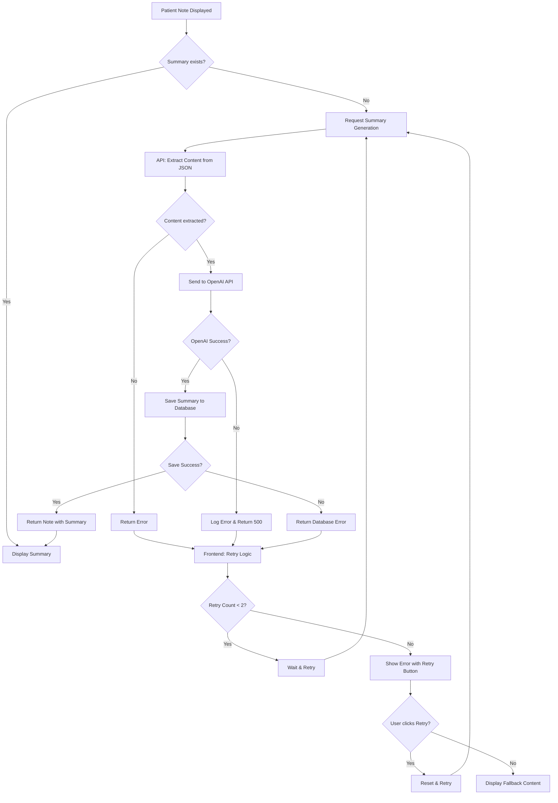

# Note Summary Generation Fix

## Problem
Many patient notes were stuck on "Loading Summary" while some summaries loaded successfully. The issue was caused by:

1. **Content Extraction Issue**: The API was not properly extracting the actual note content from the JSON-stored format before sending it to OpenAI
2. **Error Handling**: The OpenAI API calls lacked proper error handling, causing silent failures
3. **Frontend Retry Logic**: No retry mechanism existed for failed summary generations

## Solution

### 1. API Fixes (app/api/notes/[id]/route.ts)
- Added `extractContent` import to properly parse stored JSON content
- Wrapped OpenAI API calls in try-catch blocks for better error handling
- Added logging for debugging failed summary generations
- Returns proper error responses when content extraction or OpenAI calls fail

### 2. Frontend Improvements (app/components/SupabasePatientNotes.tsx)
- Added retry logic with exponential backoff (up to 2 retries)
- Shows "Summary generation failed" with a retry button for failed summaries
- Better error state handling and user feedback

### 3. Bulk Summary Generation Script (scripts/generate-all-summaries.ts)
- Created a script to generate summaries for all existing notes without them
- Includes rate limiting to avoid OpenAI API limits
- Provides progress tracking and error reporting

## Summary Generation Flow

The following diagram illustrates how summary generation works with the new error handling and retry logic:



## Usage

### Check Summary Status
```bash
curl http://localhost:3000/api/notes/summary-status
```

### Debug Specific Note
```bash
curl http://localhost:3000/api/notes/debug/[NOTE_ID]
```

### Generate Missing Summaries
```bash
npm run supabase:generate-summaries
```

### Environment Variables Required
- `OPENAI_API_KEY` - Your OpenAI API key
- `NEXT_PUBLIC_SUPABASE_URL` - Your Supabase project URL
- `SUPABASE_SERVICE_ROLE_KEY` - Your Supabase service role key (for the script)

## How It Works

1. **Real-time Generation**: When a note is displayed without a summary, the frontend automatically requests one
2. **Retry Logic**: If generation fails, it retries up to 2 times with exponential backoff
3. **Manual Retry**: Users can click a "Retry" button for failed summaries
4. **Bulk Generation**: The script can process all notes without summaries at once

## Monitoring

The diagnostic endpoint provides real-time statistics:
- Total notes in the system
- Notes with summaries
- Notes without summaries
- Percentage complete
- Configuration status

## Troubleshooting

### Summaries Still Not Generating
1. Check if `OPENAI_API_KEY` is set in `.env.local`
2. Verify OpenAI API key has sufficient credits
3. Check browser console for error messages
4. Use the diagnostic endpoint to verify configuration
5. Use the debug endpoint to check if specific notes exist: `/api/notes/debug/[NOTE_ID]`
6. Click the "Debug" button next to failed summaries for detailed note information

### Bulk Generation Script Fails
1. Ensure `SUPABASE_SERVICE_ROLE_KEY` is set in `.env.local`
2. Check if the Supabase database is accessible
3. Verify the notes table has the summary column
4. Check script output for specific error messages 