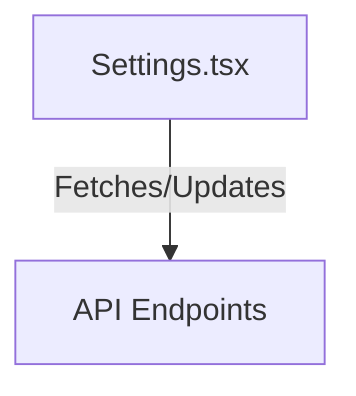

# Component Relationships

This document outlines the relationships between key components in the application.

## Core Components

## Component Responsibilities

### Settings Component
- The Settings component (`Settings.tsx`) provides a unified interface for managing application settings
- It connects to the `/api/settings` API endpoint for configuration management

## API Integration
- Settings are managed through a centralized `/api/settings` endpoint
- The endpoint handles both fetching and updating application settings

## Notes
- All settings are now managed through a single unified interface
- The application uses a consistent settings format across all components
