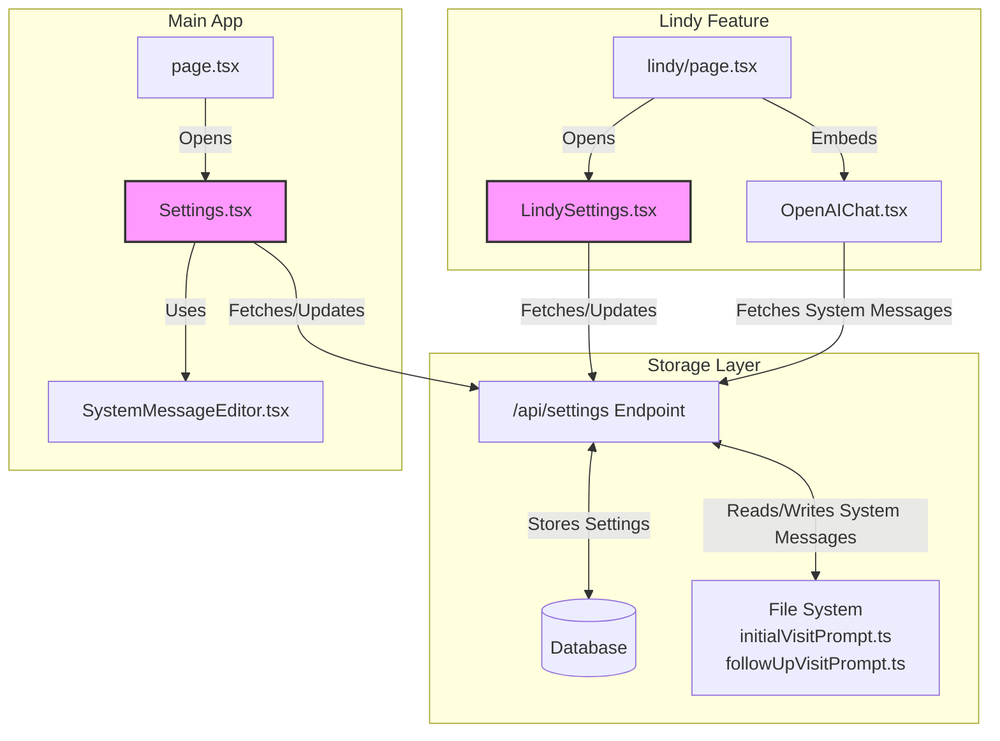

# Component Relationship Diagram

## Explanation

This diagram illustrates the relationship between the main app components and the Lindy feature components, highlighting where functionality overlaps:

1. **Parallel User Interfaces**:
   - The main app uses `page.tsx` as its primary interface, opening `Settings.tsx` for configuration
   - The Lindy feature uses `lindy/page.tsx`, which embeds `OpenAIChat.tsx` and opens `LindySettings.tsx` for configuration

2. **Shared Backend**:
   - Both `Settings.tsx` and `LindySettings.tsx` connect to the same `/api/settings` API endpoint
   - Both interfaces ultimately modify the same data: system messages stored in files and settings stored in database

3. **Duplicate Functionality**:
   - The highlighted components (`LindySettings.tsx` and `Settings.tsx`) have significant functional overlap
   - Both components edit the same system message data, creating redundancy in the codebase

4. **Integration Point**:
   - The API endpoint serves as the integration point between both interfaces
   - Any changes made in one interface are reflected in the other due to shared data storage

This visualization demonstrates why consolidating to a single settings interface would reduce code duplication while maintaining all functionality.
